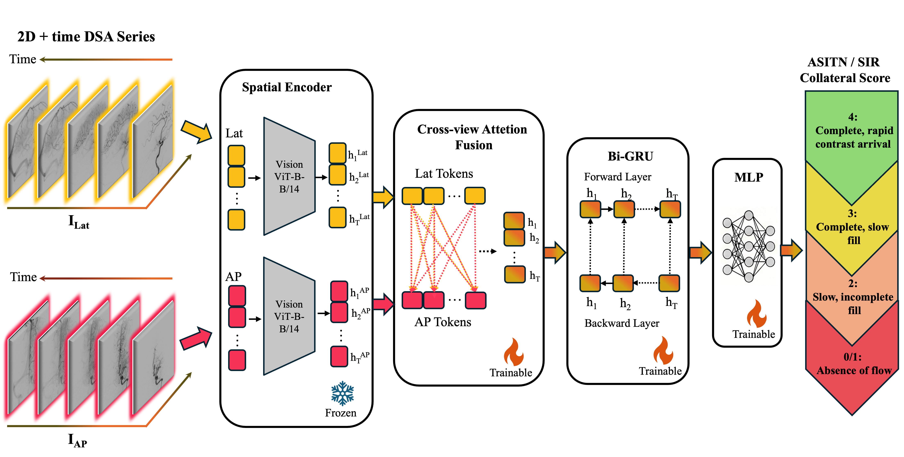
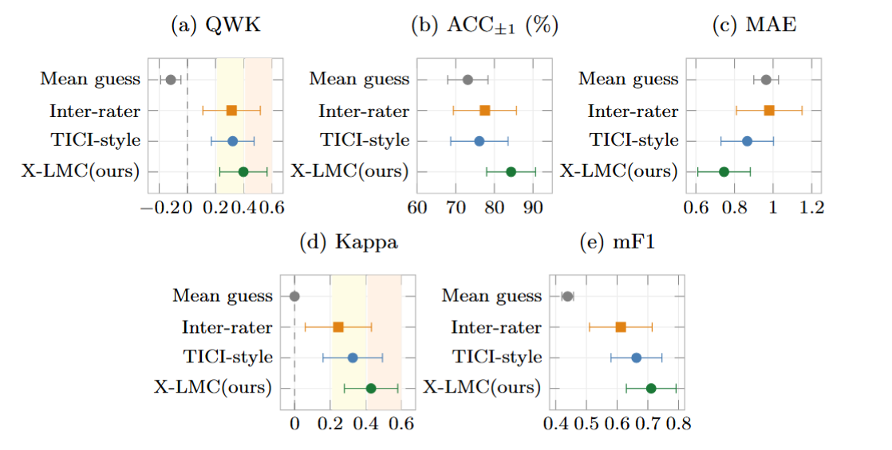
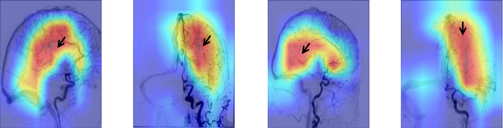

# X-LMC: Cross-View Spatiotemporal Collateral Scoring from DSA

### 🎉 Accepted to the SWITCH Workshop at MICCAI 2026

Official implementation of **X-LMC**, a deep learning framework for automated ASITN/SIR leptomeningeal collateral (LMC) grading from time-resolved biplane digital subtraction angiography (DSA).

---

## Overview

Leptomeningeal collateral status is a critical prognostic indicator in acute ischemic stroke, informing secondary treatment strategies, neurorehabilitation planning, and retrospective stroke research. DSA is the reference standard for LMC assessment, providing direct, high-fidelity visualization of collateral microvasculature — yet clinical grading via the ASITN/SIR scale remains manual, time-intensive, and highly variable across raters.

X-LMC addresses this gap by formulating collateral grading as a **multi-view spatiotemporal learning problem**. For each patient, synchronized anteroposterior (AP) and lateral (LAT) DSA sequences are jointly processed through three stages:

1. **Frame-wise spatial encoding** — each AP and LAT frame is independently encoded using a frozen DINOv2 ViT-B/14 backbone, retaining token-level representations for subsequent cross-view interaction.
2. **Bidirectional cross-view attention (X-Attn)** — at each timepoint, token-level representations from the AP and LAT projections mutually attend to one another, producing view-enhanced fused frame representations.
3. **Temporal modeling** — the fused sequence is processed by a bidirectional GRU (Bi-GRU) to capture contrast bolus dynamics across the full angiographic acquisition. The final spatiotemporal representation is passed to an MLP classifier for ASITN/SIR grade prediction.

<div>
  

  <p>
    <em>
      Figure 1. Overview of the X-LMC framework. Frame-wise features from synchronized AP and LAT DSA sequences are extracted using a frozen DINOv2 backbone, fused via bidirectional cross-view attention, and temporally modeled using a Bi-GRU before final ASITN/SIR grade prediction.
    </em>
  </p>
</div>


## Results

Evaluated on **134 patients with M1-segment MCA occlusions** (multicenter MAGIC repository) using 5-fold cross-validation. Performance is reported against a TICI-style spatiotemporal baseline, a mean-guess baseline, and observed clinical inter-rater agreement. Whiskers show 95% bootstrap confidence intervals; shaded bands indicate fair [0.21–0.40] and moderate [0.41–0.60] agreement ranges.

<p align="left">
  
</p>

<p align="left">
  <em>
    Figure 2. Multiclass (top) and binary (bottom) performance comparison across all evaluated metrics:<br>
    (a) quadratic weighted kappa (QWK), (b) accuracy within ±1 grade (ACC±1), (c) mean absolute error (MAE), (d) Cohen's kappa, and (e) macro-averaged F1-score (mF1).
  </em>
</p>
X-LMC achieves higher point estimates than static and spatiotemporal baselines across all metrics (QWK: 0.398 vs. 0.322; macro-F1: 0.711 vs. 0.663), with performance aligning with the observed inter-rater agreement — reflecting the inherent label ambiguity of the ASITN/SIR scale as a shared ceiling for both human and automated assessment.

Grad-CAM activations show saliency frequently localized to distal cortical territories consistent with ASITN/SIR assessment regions in good collateral cases, with more central vascular activation in poor collateral cases.

<p align="left">
  
</p>

<p align="left">
  <em>
    Figure 3. Frame-averaged Grad-CAM activations for good (a, b) and poor (c, d) ASITN/SIR collateral cases.<br>
    Arrows indicate collateral vessels. Saliency in good collateral cases is concentrated over distal cortical territories, consistent with the regions assessed during ASITN/SIR grading.
  </em>
</p>


## Installation

```bash
git clone https://github.com/maedehafezi/X-LMC.git
cd X-LMC
pip install -r requirements.txt
```

---

## Dataset

Experiments were conducted on pre-interventional biplane DSA acquisitions from the multicenter **MAGIC** repository. The clinical dataset is not included due to patient privacy restrictions.

DSA series were preprocessed as follows: temporally standardized to 2 fps via linear interpolation, truncated at 30 frames, pre-contrast baseline frames removed, and resized to 224 × 224 pixels normalized to [0, 1].

---

## Training

```bash
python train.py \
    --train_csv train_fold0.csv \
    --val_csv val_fold0.csv \
    --test_csv test_fold0.csv \
    --root_dir /path/to/dsa/data \
    --input-type sequence \
    --batch-size 1 \
    --learning-rate 0.001 \
    --optimizer adam \
    --epochs 1000
```

Paired AP/LAT augmentation includes horizontal flipping, random spatial shifts, scaling, rotation, and contrast perturbation. Model selection is based on validation loss, with early stopping (patience = 50) and learning-rate scheduling (ReduceLROnPlateau).

### Weights & Biases

Training is logged to [Weights & Biases](https://wandb.ai/) in real-time. A run link will be printed to the console at the start of training — click it to access your dashboard, where loss and validation curves, gradient histograms, and predictions are tracked automatically.

To use an existing W&B account, set your API key before training:

```bash
export WANDB_API_KEY=your_api_key
```

---

## Citation

```bibtex
@inproceedings{hafezi2026xlmc,
  title     = {X-LMC: Cross-View Spatiotemporal Collateral Circulation Scoring from DSA},
  author    = {Hafezi Moghadas, Maedeh and Baazaoui, Hakim and Otto, Lukas Bastian and Wegener, Susanne and Menze, Bj{\"o}rn and De la Rosa, Ezequiel},
  booktitle = {SWITCH Workshop at MICCAI},
  year      = {2026}
}
```

---

## Referenced Work

- **MAGIC Repository** — Baazaoui et al., *The multicentre acute ischemic stroke imaging and clinical data (MAGIC) repository: rationale and blueprint*, Frontiers in Neuroinformatics, 2025. [[Paper]](https://doi.org/10.3389/fninf.2024.1508161)
- **DINOv2** — Oquab et al., *DINOv2: Learning Robust Visual Features without Supervision*, arXiv 2023. [[Paper]](https://arxiv.org/abs/2304.07193)
- **DeepTICI** — Nielsen et al., *Deep learning–based automated thrombolysis in cerebral infarction scoring*, Stroke, 2021. [[Paper]](https://www.ahajournals.org/doi/10.1161/STROKEAHA.120.033807)
- **ASITN/SIR Scale** — Higashida & Furlan, *Trial design and reporting standards for intra-arterial cerebral thrombolysis for acute ischemic stroke*, Stroke, 2003. [[Paper]](https://doi.org/10.1161/01.STR.0000082721.62796.09)
- **Grad-CAM** — Selvaraju et al., *Grad-CAM: Visual Explanations from Deep Networks via Gradient-based Localization*, IJCV, 2020. [[Paper]](https://doi.org/10.1007/s11263-019-01228-7)

---

## Acknowledgments

This work was conducted in collaboration with Friedrich-Alexander-Universität Erlangen-Nürnberg, University Hospital Zurich, and the University of Zurich. Ezequiel De la Rosa and Björn Menze are supported by the Helmut Horten Foundation.

## License

This project is released under the **Apache License 2.0**.
